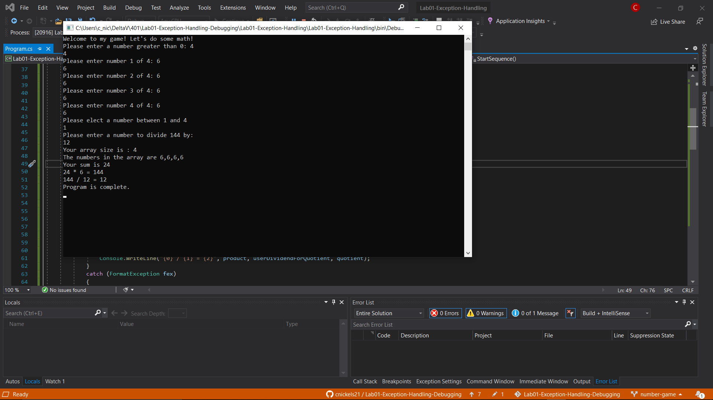
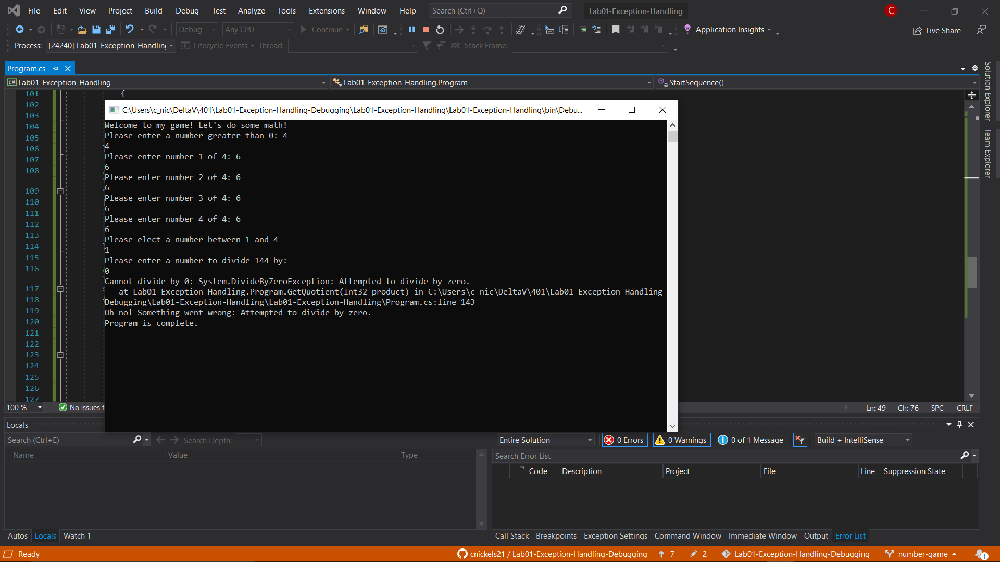

# Lab01-Exception-Handling-Debugging

A number game console app for the day one lab of 401.

## Setup

To create this app and set it up I first created a Github repo and cloned it down to my local environment.  Then in VS Core I created a new project inside of that repo and structured out my director scaffolding with a git ignore and such.  After this it was simply writing the code to make the program run as desired, as explained in the following section.

## Description

This is a console application that uses the C# language written in the .NET Core Framework.  The purpose is to take user input that defines an array and its values, then perform various operations using those values and other specific values given by the user.  The overall point of this lab was to practice using try\catches to handle exceptions within the program.  A couple examples include FormatException and DivideByZeroException, which are handled within their respected methods accordingly. Below is a screen shot of the expected output of the app if no exceptions have occured as well as a screen shot of an example of an exception being thrown:

